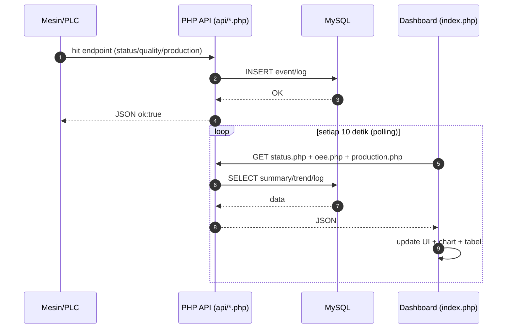

<a id="top"></a>

# Thread Extruder Monitoring System (PHP Native) — API + Dashboard


> Sistem **Monitoring + Historis + Kontrol Mesin** berbasis **PHP Native + MySQL** untuk Extruder (Tread/Sidewall).  
> Dashboard melakukan **realtime polling** ke API, sedangkan mesin/PLC melakukan **hit API** untuk mengirim status, runtime/downtime, produksi, dan quality.

---

## Table of Contents
- [Highlight Fitur](#highlight-fitur)
- [Metrik](#metrik)
- [Tech Stack](#tech-stack)
- [Struktur Folder](#struktur-folder)
- [Quick Start (Localhost)](#quick-start-localhost)
- [Deployment (Hosting)](#deployment-hosting)
- [Base Path](#base-path)
- [Realtime Flow](#realtime-flow)
- [Dokumentasi API](#dokumentasi-api)
- [Testing Cepat](#testing-cepat)
- [Security Notes](#security-notes)
- [Troubleshooting](#troubleshooting)
- [Roadmap](#roadmap)
- [Contributing](#contributing)
- [License](#license)

---

## Highlight Fitur

- ✅ **Monitoring Status Mesin (ON/OFF)** (Monitoring & Historis)
- ✅ **Runtime & Downtime** (event-based + fallback dari status history)
- ✅ **Production** (total qty + trend)
- ✅ **Quality OK/NG** + defect type (opsional)
- ✅ **OEE (Availability × Performance × Quality)** otomatis
- ✅ **Dashboard realtime** (auto-refresh polling)
- ✅ **API siap di-hosting** (mesin bisa hit endpoint online)

<p align="right">(<a href="#top">Back to top ⬆️</a>)</p>

---

## Metrik

| No | Metrik | Jenis Data | Aspek OEE |
|---:|---|---|---|
| 1 | Status Mesin (ON/OFF) | Historis | Availability (support) |
| 2 | Status Mesin (ON/OFF) | Monitoring | Availability (support) |
| 3 | Waktu Operasi Extruder | Historis | Availability |
| 4 | Downtime / Aktivasi Mesin | Kontrol | Availability |
| 5 | Pengaktifan Mesin (via HMI/Web) | Kontrol | Availability |
| 6 | Jumlah Produksi Aktual | Historis | Performance |
| 7 | Jumlah Produk OK/NG | Historis | Quality |

---

## Tech Stack

- **Backend:** PHP Native (API endpoint via `api/*.php`)
- **Database:** MySQL/MariaDB
- **Frontend:** Bootstrap + Chart.js + Vanilla JS (`assets/js/main.js`)
- **Realtime:** Polling interval (default 10s, configurable)

---

## Struktur Folder

```txt
WEB_API_MASRIKZA/
├─ api/
│  ├─ config.php
│  ├─ db.php
│  ├─ downtime.php
│  ├─ insert.php
│  ├─ oee.php
│  ├─ production_log.php
│  ├─ production.php
│  ├─ quality.php
│  ├─ realtime.php
│  ├─ runtime.php
│  └─ status.php
│
├─ assets/
│  ├─ css/
│  │  ├─ charts.css
│  │  ├─ dashboard.css
│  │  ├─ responsive.css
│  │  └─ style.css
│  └─ js/
│     └─ main.js
│
├─ includes/
│  ├─ config.php
│  ├─ footer.php
│  ├─ header.php
│  └─ sidebar.php
│
├─ pages/
│  ├─ control.php
│  ├─ oee.php
│  ├─ production.php
│  ├─ quality.php
│  └─ reports.php
│
└─ index.php
```

<p align="right">(<a href="#top">Back to top ⬆️</a>)</p>

---

## Quick Start (Localhost)

1) **Requirement**
- PHP 7.4+ / 8.x
- MySQL/MariaDB
- Web server: Laragon / XAMPP / Apache / Nginx

2) **Setup Database**
- Buat database baru (contoh): `api_new`
- Import file SQL (contoh: `Api-new.sql`)

```bash
mysql -u root -p api_new < Api-new.sql
```

3) **Konfigurasi DB**
- `includes/config.php` (web/dashboard)
- `api/config.php` (API)

Pastikan `host`, `user`, `pass`, `dbname` mengarah ke database yang sama.

4) **Jalankan**
- Taruh folder project ke `www` (Laragon) / `htdocs` (XAMPP)
- Buka:
  `http://localhost/WEB_API_MASRIKZA/`

---

## Deployment (Hosting)

1) Upload semua file ke public folder hosting (misal: `public_html/monitoring/`)
2) Update DB config sesuai kredensial hosting
3) Pastikan PHP extension `pdo_mysql` aktif
4) Pastikan base path sesuai (lihat Base Path di bawah)

---

## Base Path

Jika hosting di subfolder, contoh:

```
https://domain.com/monitoring/
```

Pastikan `APP_BASE_PATH` otomatis sesuai (cek `includes/config.php`).

---

## Realtime Flow



---

## Dokumentasi API

Format response umum:

```json
{ "ok": true, "mode": "...", "timestamp": "YYYY-MM-DD HH:mm:ss" }
```

### 1) Dashboard Summary
```
GET /api/status.php?hours=24
```

### 2) Realtime Ringkas
```
GET /api/realtime.php?hours=8
```

### 3) Kontrol Mesin
```
GET /api/status.php?mode=control_baca
GET /api/status.php?mode=control_update&status=ON
GET /api/status.php?mode=control_update&status=OFF
GET /api/status.php?mode=control_history&limit=10
```

### 4) Input Status dari Mesin
```
GET /api/status.php?mode=input_status&status=ON&duration=300&qty=10
GET /api/status.php?mode=input_status&status=OFF&duration=600
```

### 5) Quality Check (OK/NG)
```
GET /api/status.php?mode=input_tread_checked&result=OK&qty=1
GET /api/status.php?mode=input_tread_checked&result=NG&qty=1&defect=CRACK
```

Opsional tambahan (jika schema DB mendukung):
- `batch_no`, `shift=A|B|C`, `operator`, `notes`, `tread_type=TREAD|SIDEWALL`

### 6) Production Summary
```
GET /api/production.php?hours=24
```

### 7) Production Log (ringkas)
```
GET /api/production_log.php?limit=10
```

### 8) Runtime & Downtime
```
GET /api/runtime.php?hours=8
GET /api/downtime.php?hours=8
```

### 9) OEE
```
GET /api/oee.php?hours=8&ideal_rate_per_hour=60
```

### Machine ID (opsional)
Semua endpoint di atas bisa menerima `machine_id=EXTRUDER_01` untuk filtering.

---

## Testing Cepat

Windows PowerShell (contoh):

```bash
curl "http://localhost/WEB_API_MASRIKZA/api/status.php"
curl "http://localhost/WEB_API_MASRIKZA/api/status.php?mode=control_baca"
curl "http://localhost/WEB_API_MASRIKZA/api/status.php?mode=control_update&status=ON"
curl "http://localhost/WEB_API_MASRIKZA/api/status.php?mode=input_status&status=ON&duration=120&qty=5"
curl "http://localhost/WEB_API_MASRIKZA/api/status.php?mode=input_tread_checked&result=OK&qty=2"
curl "http://localhost/WEB_API_MASRIKZA/api/oee.php?hours=8&ideal_rate_per_hour=60"
```

---

## Security Notes

Karena ini API untuk mesin & kontrol, sebaiknya jangan open tanpa proteksi.

Rekomendasi minimal:
- Tambah API Key (header atau query param) untuk endpoint write:
  - `mode=control_update`
  - `mode=input_status`
  - `mode=input_tread_checked`
- Batasi IP (allowlist IP mesin/PLC)
- Rate limit (anti spam)
- Gunakan POST untuk insert/update (lebih aman daripada GET)
- Jangan expose error detail di produksi (log saja)

---

## Troubleshooting

<details>
<summary><b>API 404 / Not Found</b></summary>

- Cek base path: `APP_BASE_PATH`
- Pastikan file ada di folder `api/`
- Pastikan `.htaccess` (jika ada) tidak memblok `/api/*`

</details>

<details>
<summary><b>Data tidak berubah (padahal DB berubah)</b></summary>

- Cek polling JS: buka Console
- Cek endpoint response di Network
- Pastikan jam server sesuai (MySQL NOW() vs timezone)

</details>

<details>
<summary><b>Runtime/Downtime 0 terus</b></summary>

- Pastikan mesin mengirim `mode=input_status`
- Pastikan data masuk ke `machine_events` dengan `metric_code`:
  - `RUNTIME`
  - `DOWNTIME`
- Jika event runtime/downtime tidak ada, sistem fallback ke `STATUS_HIST`

</details>

<details>
<summary><b>OEE selalu 0%</b></summary>

- OEE = A × P × Q
- Pastikan:
  - ada runtime > 0
  - ada produksi > 0
  - ada OK qty > 0
  - `ideal_rate_per_hour` masuk akal

</details>

---

## Roadmap

- Auth token / API key
- WebSocket / SSE realtime (tanpa polling)
- Role user (Operator/Admin)
- Export report (CSV/PDF)
- Alarm & notifikasi downtime

---

## Contributing

PR & issue dipersilakan. Sertakan:
- langkah reproduce
- screenshot error console/network
- contoh request API

---

## License

Internal / Educational

<p align="right">(<a href="#top">Back to top ⬆️</a>)</p>
